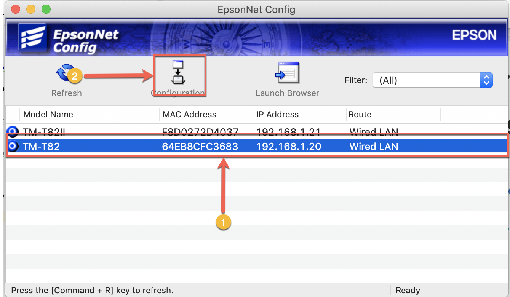
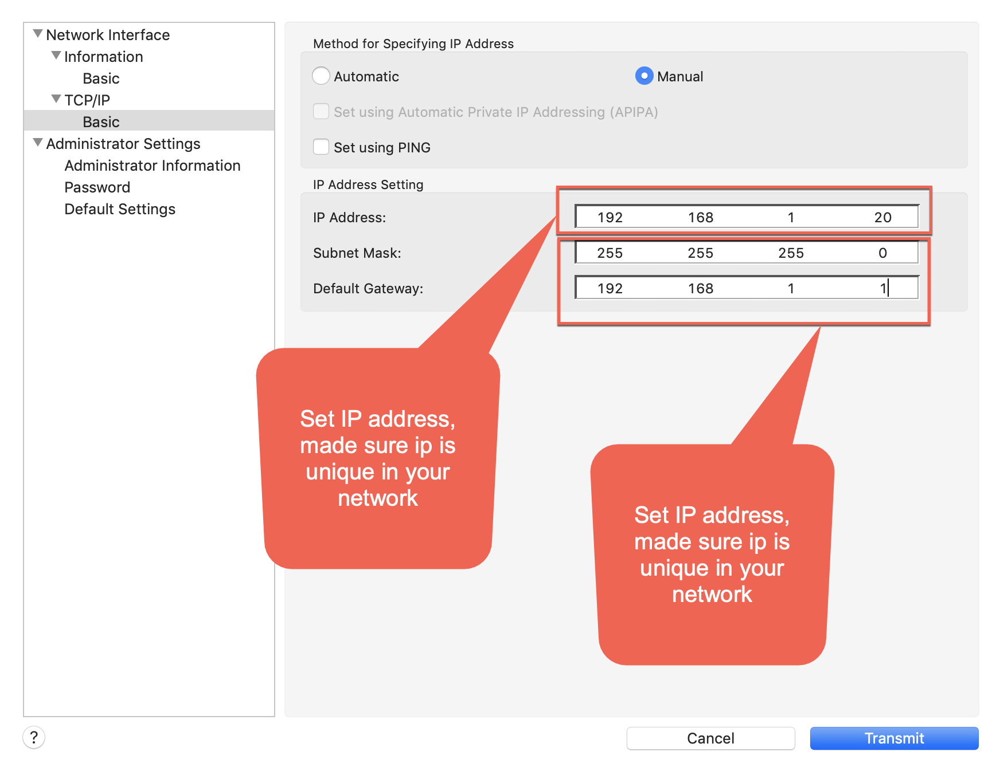

Guide Setup POSBOX support Multi Epson Printer
----------------------------------------------

Install POSBOX
----------------------------------------------
- [x] Install posbox https://odoo-development.readthedocs.io/en/latest/admin/posbox/install-posbox-image.html
- [x] first for all required need to buy one Raspi 2 Model B+ or bigger than
- [x] download image posbox 17 (Required and Only Supported version 17): https://nightly.odoo.com/master/posbox/posbox_image_v17.zip
- [x] install posbox version 17 follow this link [a link] https://www.odoo.com/forum/help-1/question/step-by-step-guide-for-installing-customer-display-using-posbox-125783

Update POSBOX with my module
----------------------------------------------
- [x] first need ssh to posbox $ssh pi@[ip address of posbox] , password is raspberry
- [x] Need change to root role: $ sudo su
- [x] Mount SD card for modifiers all files of SD card: $ mount -o remount,rw /
- [x] Change permission of addons odoo: $cd /home/pi/odoo
- [x] $ sudo chmod 777 -R addons
- [x] Go to pos_retail_network_printer/guide unzip drivers.zip. copy 2 module hw_escpos and hw_screen replace to your POSBOX path : /home/pi/odoo/addons/
- [x] Reboot posbox now: $ reboot now
- [x] Final, go back to your odoo and config printers Epson IP

Download Epos Net Config for config Epson Printer IP address
----------------------------------------------

----------------------------------------------
- [x] Go to link [a link] https://download.epson-biz.com/modules/pos/index.php?page=single_soft&cid=6047&scat=43&pcat=3
- [x] Open Epos net and config ip the same subnetmard your lan network (network of restaurant/shop)

Back to your odoo / Menu App / pos_retail_network_priner / See document how to config multi printer
----------------------------------------------
